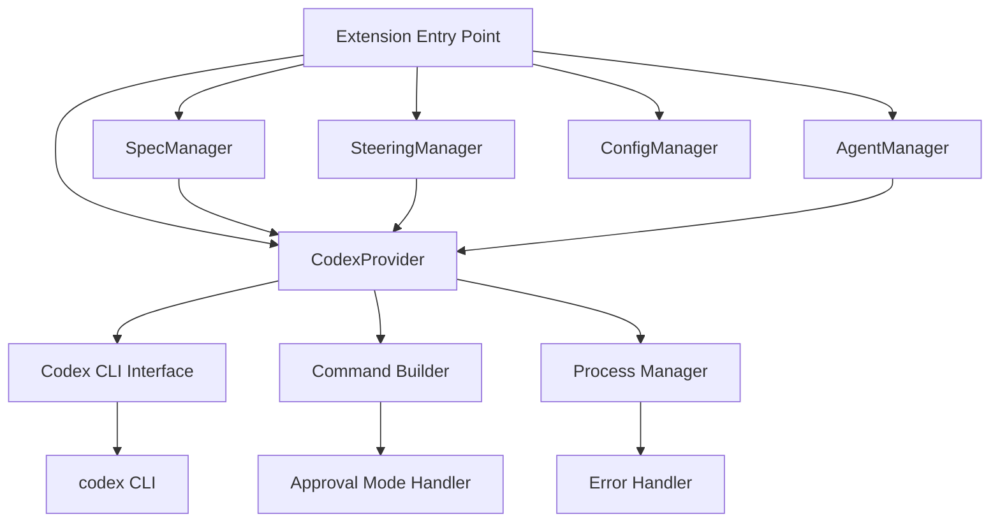

# Design Document

## Overview

This is a comprehensive design for migrating this project from Claude Code to Codex CLI. Codex CLI is an OpenAI tool that performs code generation, editing, and execution using natural language. It provides similar functionality to Claude Code but has different API structures and command systems.

Key migration objectives:
- Leverage Codex CLI advantages while maintaining existing functionality
- Migration with minimal breaking changes
- Prompt structures optimized for Codex CLI characteristics
- Robust error handling and fallback functionality

## Architecture

### Current Architecture Analysis

The current system consists of the following main components:

1. **ClaudeCodeProvider** - Manages integration with Claude Code CLI
2. **SpecManager** - Manages spec functionality (requirements, design, tasks)
3. **SteeringManager** - Manages steering functionality
4. **AgentManager** - Manages agent functionality
5. **PermissionManager** - Claude Code permission management

### New Architecture



## Components and Interfaces

### 1. CodexProvider (Replacement for ClaudeCodeProvider)

```typescript
interface CodexProvider {
    // Basic Codex CLI execution
    executeCodex(prompt: string, options?: CodexOptions): Promise<CodexResult>
    
    // Codex execution in split view
    invokeCodexSplitView(prompt: string, title?: string): Promise<vscode.Terminal>
    
    // Background Codex execution
    invokeCodexHeadless(prompt: string, options?: CodexOptions): Promise<CodexResult>
    
    // Approval mode management
    setApprovalMode(mode: ApprovalMode): void
}

interface CodexOptions {
    approvalMode?: 'interactive' | 'auto-edit' | 'full-auto'
    workingDirectory?: string
    timeout?: number
    model?: string
}

interface CodexResult {
    exitCode: number
    output?: string
    error?: string
    filesModified?: string[]
}

enum ApprovalMode {
    Interactive = 'interactive',
    AutoEdit = 'auto-edit', 
    FullAuto = 'full-auto'
}
```

### 2. Command Builder

Responsible for building Codex CLI commands:

```typescript
interface CommandBuilder {
    buildCommand(prompt: string, options: CodexOptions): string
    buildApprovalModeFlag(mode: ApprovalMode): string
    buildWorkingDirectoryFlag(path: string): string
}
```

### 3. Process Manager

Execution and management of Codex CLI processes:

```typescript
interface ProcessManager {
    executeCommand(command: string, cwd?: string): Promise<ProcessResult>
    createTerminal(command: string, options: TerminalOptions): vscode.Terminal
    killProcess(processId: string): void
}
```

### 4. Configuration Manager (Extended)

Management of Codex CLI configuration:

```typescript
interface CodexConfig {
    codexPath: string
    defaultApprovalMode: ApprovalMode
    defaultModel?: string
    timeout: number
    terminalDelay: number
}
```

## Data Models

### Configuration File Structure

```json
{
  "codex": {
    "path": "codex",
    "defaultApprovalMode": "interactive",
    "defaultModel": "gpt-5",
    "timeout": 30000,
    "terminalDelay": 1000
  },
  "migration": {
    "preserveClaudeSettings": true,
    "backupOriginalFiles": true
  }
}
```

### Prompt Structure Optimization

Prompt templates for Codex CLI:

```markdown
# Task: {taskTitle}

## Context
{contextInformation}

## Requirements
{requirements}

## Expected Output
{expectedOutput}

## Constraints
- Use best practices for {language/framework}
- Ensure code is well-documented
- Follow existing project structure
```

## Error Handling

### 1. Codex CLI Availability Check

```typescript
async function checkCodexAvailability(): Promise<boolean> {
    try {
        const result = await executeCommand('codex --version')
        return result.exitCode === 0
    } catch (error) {
        return false
    }
}
```

### 2. Error Classification and Response

| Error Type | Detection Method | Response Strategy |
|------------|------------------|-------------------|
| CLI Not Installed | Command execution failure | Display installation instructions |
| Authentication Error | Specific error messages | Authentication setup guide |
| Process Timeout | Execution time exceeded | Retry or user notification |
| File Access Error | Permission errors | Permission verification and guide |

### 3. Fallback Functionality

```typescript
interface FallbackStrategy {
    // Alternative when Codex CLI fails
    fallbackToManualMode(): void
    
    // Provide limited functionality
    provideLimitedFunctionality(): void
    
    // User guidance
    showTroubleshootingGuide(): void
}
```

## Testing Strategy

### 1. Unit Tests

- Each method of **CodexProvider**
- Command generation in **CommandBuilder**
- Process management in **ProcessManager**
- Configuration loading in **ConfigManager**

### 2. Integration Tests

- Actual integration with Codex CLI
- File operation verification
- Error handling behavior confirmation

### 3. End-to-End Tests

- Complete workflow from spec creation to implementation
- Steering functionality verification
- Agent functionality validation

### 4. Performance Tests

- Codex CLI execution time measurement
- Memory usage monitoring
- Large file processing performance verification

## Migration Strategy

### Phase 1: Foundation Preparation
1. CodexProvider implementation
2. Configuration system extension
3. Basic error handling

### Phase 2: Feature Migration
1. SpecManager Codex support
2. SteeringManager Codex support
3. AgentManager Codex support

### Phase 3: Optimization and Verification
1. Prompt template optimization
2. Performance tuning
3. Comprehensive test execution

### Phase 4: Migration Completion
1. Claude Code dependency removal
2. Documentation updates
3. Release preparation

## Security Considerations

### 1. Command Execution Security
- Command injection prevention
- Proper execution permission management
- Detection and prevention of dangerous commands

### 2. File Access Control
- Working directory restrictions
- Protection of important files
- Backup functionality implementation

### 3. Authentication Information Management
- Secure storage of API keys
- Configuration file encryption
- Principle of least privilege

## Performance Optimization

### 1. Process Management Optimization
- Process pool implementation
- Parallel execution control
- Resource usage monitoring

### 2. Caching Strategy
- Command result caching
- Configuration information memory caching
- File change differential detection

### 3. User Experience
- Progress display
- Asynchronous processing utilization
- Responsive UI updates