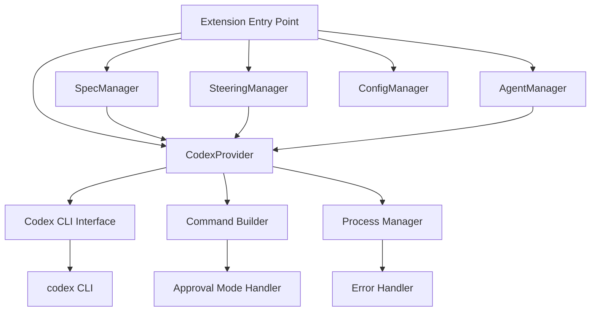

# Design Document

## Overview

このプロジェクトをClaude CodeからCodex CLIに移行するための包括的な設計です。Codex CLIは自然言語でコード生成・編集・実行を行うOpenAIのツールで、Claude Codeと同様の機能を提供しますが、異なるAPI構造とコマンド体系を持ちます。

移行の主要な目標：
- 既存の機能を維持しながらCodex CLIの利点を活用
- 最小限の破壊的変更での移行
- Codex CLIの特性に最適化されたプロンプト構造
- 堅牢なエラーハンドリングとフォールバック機能

## Architecture

### 現在のアーキテクチャ分析

現在のシステムは以下の主要コンポーネントで構成されています：

1. **ClaudeCodeProvider** - Claude Code CLIとの統合を管理
2. **SpecManager** - spec機能（requirements、design、tasks）の管理
3. **SteeringManager** - steering機能の管理
4. **AgentManager** - エージェント機能の管理
5. **PermissionManager** - Claude Code権限管理

### 新しいアーキテクチャ



## Components and Interfaces

### 1. CodexProvider (ClaudeCodeProviderの置き換え)

```typescript
interface CodexProvider {
    // Codex CLIの基本実行
    executeCodex(prompt: string, options?: CodexOptions): Promise<CodexResult>
    
    // 分割ビューでのCodex実行
    invokeCodexSplitView(prompt: string, title?: string): Promise<vscode.Terminal>
    
    // バックグラウンドでのCodex実行
    invokeCodexHeadless(prompt: string, options?: CodexOptions): Promise<CodexResult>
    
    // 承認モードの管理
    setApprovalMode(mode: ApprovalMode): void
}

interface CodexOptions {
    approvalMode?: 'interactive' | 'auto-edit' | 'full-auto'
    workingDirectory?: string
    timeout?: number
    model?: string
}

interface CodexResult {
    exitCode: number
    output?: string
    error?: string
    filesModified?: string[]
}

enum ApprovalMode {
    Interactive = 'interactive',
    AutoEdit = 'auto-edit', 
    FullAuto = 'full-auto'
}
```

### 2. Command Builder

Codex CLIコマンドの構築を担当：

```typescript
interface CommandBuilder {
    buildCommand(prompt: string, options: CodexOptions): string
    buildApprovalModeFlag(mode: ApprovalMode): string
    buildWorkingDirectoryFlag(path: string): string
}
```

### 3. Process Manager

Codex CLIプロセスの実行と管理：

```typescript
interface ProcessManager {
    executeCommand(command: string, cwd?: string): Promise<ProcessResult>
    createTerminal(command: string, options: TerminalOptions): vscode.Terminal
    killProcess(processId: string): void
}
```

### 4. Configuration Manager (拡張)

Codex CLI設定の管理：

```typescript
interface CodexConfig {
    codexPath: string
    defaultApprovalMode: ApprovalMode
    defaultModel?: string
    timeout: number
    terminalDelay: number
}
```

## Data Models

### 設定ファイル構造

```json
{
  "codex": {
    "path": "codex",
    "defaultApprovalMode": "interactive",
    "defaultModel": "gpt-4",
    "timeout": 30000,
    "terminalDelay": 1000
  },
  "migration": {
    "preserveClaudeSettings": true,
    "backupOriginalFiles": true
  }
}
```

### プロンプト構造の最適化

Codex CLI向けのプロンプトテンプレート：

```markdown
# Task: {taskTitle}

## Context
{contextInformation}

## Requirements
{requirements}

## Expected Output
{expectedOutput}

## Constraints
- Use best practices for {language/framework}
- Ensure code is well-documented
- Follow existing project structure
```

## Error Handling

### 1. Codex CLI利用可能性チェック

```typescript
async function checkCodexAvailability(): Promise<boolean> {
    try {
        const result = await executeCommand('codex --version')
        return result.exitCode === 0
    } catch (error) {
        return false
    }
}
```

### 2. エラー分類と対応

| エラータイプ | 検出方法 | 対応策 |
|-------------|----------|--------|
| CLI未インストール | コマンド実行失敗 | インストール手順表示 |
| 認証エラー | 特定のエラーメッセージ | 認証設定ガイド |
| プロセスタイムアウト | 実行時間超過 | 再試行またはユーザー通知 |
| ファイルアクセスエラー | 権限エラー | 権限確認とガイド |

### 3. フォールバック機能

```typescript
interface FallbackStrategy {
    // Codex CLI失敗時の代替手段
    fallbackToManualMode(): void
    
    // 部分的な機能提供
    provideLimitedFunctionality(): void
    
    // ユーザーガイダンス
    showTroubleshootingGuide(): void
}
```

## Testing Strategy

### 1. ユニットテスト

- **CodexProvider**の各メソッド
- **CommandBuilder**のコマンド生成
- **ProcessManager**のプロセス管理
- **ConfigManager**の設定読み込み

### 2. 統合テスト

- Codex CLIとの実際の統合
- ファイル操作の検証
- エラーハンドリングの動作確認

### 3. エンドツーエンドテスト

- spec作成から実装までの完全なワークフロー
- steering機能の動作確認
- エージェント機能の検証

### 4. パフォーマンステスト

- Codex CLI実行時間の測定
- メモリ使用量の監視
- 大量ファイル処理の性能確認

## Migration Strategy

### Phase 1: 基盤準備
1. CodexProviderの実装
2. 設定システムの拡張
3. 基本的なエラーハンドリング

### Phase 2: 機能移行
1. SpecManagerのCodex対応
2. SteeringManagerのCodex対応
3. AgentManagerのCodex対応

### Phase 3: 最適化と検証
1. プロンプトテンプレートの最適化
2. パフォーマンス調整
3. 包括的なテスト実行

### Phase 4: 移行完了
1. Claude Code依存の削除
2. ドキュメント更新
3. リリース準備

## Security Considerations

### 1. コマンド実行の安全性
- コマンドインジェクション防止
- 実行権限の適切な管理
- 危険なコマンドの検出と防止

### 2. ファイルアクセス制御
- 作業ディレクトリの制限
- 重要ファイルの保護
- バックアップ機能の実装

### 3. 認証情報の管理
- API キーの安全な保存
- 設定ファイルの暗号化
- 権限の最小化原則

## Performance Optimization

### 1. プロセス管理の最適化
- プロセスプールの実装
- 並列実行の制御
- リソース使用量の監視

### 2. キャッシュ戦略
- コマンド結果のキャッシュ
- 設定情報のメモリキャッシュ
- ファイル変更の差分検出

### 3. ユーザーエクスペリエンス
- 進行状況の表示
- 非同期処理の活用
- レスポンシブなUI更新