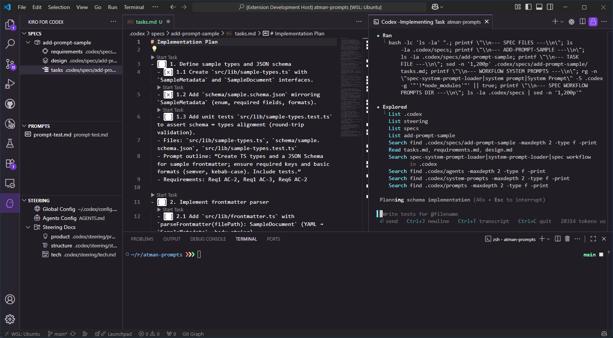

# Kiro for Codex

[](https://marketplace.visualstudio.com/items?itemName=atman-dev.kiro-for-codex)
[](https://marketplace.visualstudio.com/items?itemName=atman-dev.kiro-for-codex)
[](https://github.com/atman-33/kiro-for-codex/stargazers)
[](https://github.com/atman-33/kiro-for-codex/issues)

A VS Code extension that brings spec-driven development to Codex CLI. Manage your specs, steering documents, and custom prompts visually while leveraging Codex CLI's powerful AI capabilities.

## Features

### 📝 SPEC Management

- Create Specs: generate requirements, design, and task documents with Codex CLI
- Visual Explorer: browse and manage specs in the sidebar
- Spec Workflow: Requirements -> Design -> Tasks with a review at each step
- CodeLens for Tasks: execute an individual task from `tasks.md` via Codex and auto-check it off

### 🎯 STEERING Management

- Steering Documents: browse and edit global/project-specific guidelines
- Generated Docs: product, tech, and structure steering documents

### 🧩 PROMPTS

- Create Prompts: scaffold `.codex/prompts/<name>.md` from the Prompts view
- Click to Open: clicking a prompt opens the Markdown for review
- Inline Run Button: use the ▶ action on the right to execute with Codex CLI
- Organize & Refresh: manage a workspace prompt library with quick refresh
- Markdown Simplicity: no front-matter required; write plain Markdown instructions

### 🚫 Temporarily Disabled Views/Flows

- AGENTS, HOOKS, MCP views: hidden in this build
- "New Spec with Agents" flow: disabled

## Screenshot



The extension provides an organized sidebar for OVERVIEW, SPEC, STEERING, and PROMPTS. Other views are hidden in this build.

## Installation

### Prerequisites

- Codex CLI v0.28.0 or later installed and available on PATH
- VS Code 1.84.0 or later

Compatibility:

| Platform             | Support | Notes                                      | Status   |
| -------------------- | ------- | ------------------------------------------ | -------- |
| macOS                | Yes     | Fully supported                            | released |
| Linux                | Yes     | Fully supported                            | released |
| Windows (WSL)        | Yes     | Supported with conditional path conversion | released |
| Windows (PowerShell) | Yes     | Recommended on Windows                     | beta     |

### From Extension Marketplace

VS Code users:

1. Open VS Code
2. Go to Extensions (Cmd/Ctrl+Shift+X)
3. Search for "Kiro for Codex"
4. Click Install

Or via command line:

```bash
code --install-extension atman-33.kiro-for-codex
```

### From VSIX file

Download the latest `.vsix` from GitHub Releases, then:

```bash
# VS Code
code --install-extension kiro-for-codex-{latest-version}.vsix
```

Replace `{latest-version}` with the actual version number, e.g., `0.2.4`.

## Usage

### Creating a Spec

Traditional method:
1. Click the Kiro for Codex icon in the activity bar
2. In the SPEC view, click the `+` button
3. Enter a feature description
4. Codex CLI generates the requirements document
5. Review and approve before proceeding to design
6. Generate tasks after design is complete

Tip: From `tasks.md`, use the inline CodeLens action to execute a single task and auto-check it off.

### Spec Workflow

1. Requirements: define what you want to build
2. Design: create technical design after requirements approval
3. Tasks: generate implementation tasks after design approval
4. Implementation: execute tasks one by one

### Steering Documents

Create project-specific guidance:

- Click the sparkle icon to create custom steering
- Generate initial docs (product, tech, structure)
- Documents are stored under `.codex/steering/`

### Prompts

Create and run project prompts:

1. Open the Prompts view in the activity bar
2. Click `+ Create Prompt` to scaffold `.codex/prompts/<name>.md`
3. Write instructions in Markdown (no front-matter required)
4. Click the prompt item to open the file and review the content
5. Press the inline ▶ Run button to execute the prompt with Codex CLI (split view)

### Overview

The Overview view provides quick access to settings, availability checks, and helpful entry points.

## Commands (Quick Reference)

Core commands registered by the extension:

- `kfc.spec.create`: Create a new spec (requirements -> design -> tasks)
- `kfc.spec.createWithAgents`: Disabled in this build
- `kfc.spec.navigate.requirements` / `kfc.spec.navigate.design` / `kfc.spec.navigate.tasks`: Open spec documents
- `kfc.spec.implTask`: Run an individual task from `tasks.md`
- `kfc.spec.refresh`: Refresh the SPEC explorer
- `kfc.steering.create`: Create a custom steering document
- `kfc.steering.generateInitial`: Analyze the project and generate initial steering docs
- `kfc.steering.refine`: Refine an existing steering document
- `kfc.steering.delete`: Delete a steering document and update docs
- `kfc.prompts.create` / `kfc.prompts.run` / `kfc.prompts.refresh`: Manage and run prompts
- `kfc.settings.open`: Open workspace settings file `.codex/settings/kfc-settings.json`
- `kfc.menu.open`: Toggle visibility of views (Specs / Steering; others when enabled)
- `kfc.codex.checkAvailability`: Check Codex CLI availability and version
- `kfc.checkForUpdates`: Manually trigger the extension update checker

## Configuration

Project-local settings are stored in `.codex/settings/kfc-settings.json` and only contain paths. UI visibility and Codex runtime options live in VS Code settings under the `kfc.*` namespace.

Minimal settings file:

```json
{
  "paths": {
    "specs": ".codex/specs",
    "steering": ".codex/steering",
    "settings": ".codex/settings",
    "prompts": ".codex/prompts"
  }
}
```

Notes:
- Only the `paths.*` values are honored by the extension at runtime.
- Changing `paths.*` may require a window reload to take effect.
- The location of `kfc-settings.json` itself is fixed to `.codex/settings/kfc-settings.json` (editing `paths.settings` does not relocate the file).

## Workspace Structure

The extension creates the following structure in your workspace:

```plain
.codex/                      # Extension data directory
specs/                       # Feature specifications
  {spec-name}/
    requirements.md          # What to build
    design.md                # How to build
    tasks.md                 # Implementation steps
prompts/                     # Project prompts (Markdown)
  <your-prompt>.md
steering/                    # AI guidance documents
  product.md                 # Product conventions
  tech.md                    # Technical standards
  structure.md               # Code organization
settings/
  kfc-settings.json          # Extension settings
```

## Development

### Prerequisites

- Node.js 16+
- VS Code 1.84.0+
- TypeScript 5.3.0+

### Setup

```bash
# Clone the repository
git clone https://github.com/atman-33/kiro-for-codex.git
cd kiro-for-codex

# Install dependencies
npm install

# Compile TypeScript
npm run compile

# Watch mode (auto-compile on changes)
npm run watch
```

### Running the Extension

1. Open the project in VS Code
2. Press `F5` to launch Extension Development Host
3. The extension will be available in the new VS Code window

### Building

```bash
# Build VSIX package
npm run package

# Output: kiro-for-codex-{latest-version}.vsix
```

### Project Structure

```plain
src/
  extension.ts                 # Extension entry point, command registration
  constants.ts                 # Configuration constants
  features/                    # Business logic (spec, steering, etc.)
  providers/                   # VS Code TreeDataProviders
  services/                    # Process/error managers and helpers
  utils/                       # Utilities
  prompts/                     # Prompt sources (generated artifacts under prompts/target)
  types/                       # Shared types
```

### Testing

- Jest + ts-jest
- Run: `npm test` (watch: `npm run test:watch`, coverage: `npm run test:coverage`)
- Target coverage for new code: >= 80%

### Windows Notes

- PowerShell is recommended on Windows (direct Codex CLI support)
- WSL is supported with conditional path conversion

## License

This project is licensed under the MIT License. See the [LICENSE](LICENSE) file for details.

## Inspiration

Kiro for Codex was inspired by the excellent "Kiro for CC" project for Claude Code by @notdp. This extension started as a port/adaptation from Claude Code's Kiro to a Codex CLI–focused workflow, carrying over the spec-driven development experience and UI while integrating tightly with Codex CLI.

- Original project: https://github.com/notdp/kiro-for-cc
