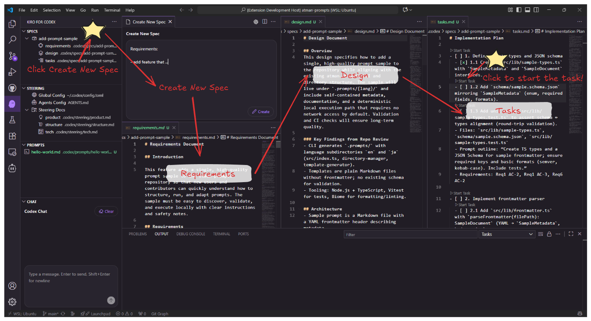

# Kiro for Codex

[](https://marketplace.visualstudio.com/items?itemName=atman-33.kiro-for-codex)
[](https://marketplace.visualstudio.com/items?itemName=atman-33.kiro-for-codex)
[](https://github.com/atman-33/kiro-for-codex/stargazers)
[](https://github.com/atman-33/kiro-for-codex/issues)

> [!IMPORTANT]
>   
> 

A VSCode extension that brings spec‑driven development to Codex CLI. Manage your specs, steering documents, and custom prompts visually while leveraging Codex CLI's powerful AI capabilities.


> **Note**: Agents, MCP, and Hooks UIs are disabled in this build. "New Spec with Agents" flow is also disabled.

## Features

### 📝 SPEC Management

- **Create Specs**: Generate requirements, design, and task documents with Codex CLI
- **Visual Explorer**: Browse and manage specs in the sidebar
- **Spec Workflow**: Requirements → Design → Tasks with review at each step
- **CodeLens for Tasks**: Execute an individual task from `tasks.md` via Codex and auto‑check it off

### ⚠️ Temporarily Disabled Views/Flows

- AGENTS, HOOKS, MCP views: hidden in this build
- "New Spec with Agents" flow: disabled

### 🎯 STEERING Management

- **Steering Documents**: Browse and edit global/project-specific guidelines
- **Generated Docs**: Product, tech, and structure steering documents


## Screenshot



*The extension provides an organized sidebar for OVERVIEW, SPEC, STEERING, and PROMPTS. Other views are hidden in this build.*

## Installation

### Prerequisites

1. **Codex CLI Installation**: Ensure Codex CLI (v0.28.0 or later) is installed and configured

2. **Compatibility**:

| Platform                  | Support | Notes                                     | Status   |
| ------------------------- | ------- | ----------------------------------------- | -------- |
| macOS                     | ✅       | Fully supported                           | released |
| Linux                     | ✅       | Fully supported                           | released |
| Windows (WSL)             | ✅       | Supported with conditional path conversion | released |
| Windows (PowerShell)      | ✅       | Recommended on Windows                    | beta     |

### From Extension Marketplace

**VSCode users:**

1. Open VSCode
2. Go to Extensions (Cmd+Shift+X)
3. Search for "Kiro for Codex"
4. Click Install

Or via command line:

```bash
code --install-extension atman-33.kiro-for-codex
```

**Cursor users:**
The extension is available on OpenVSX Registry. In Cursor:

1. Go to Extensions
2. Search for "Kiro for Codex"
3. Click Install

Or via command line:

```bash
cursor --install-extension atman-33.kiro-for-codex
```

### From VSIX file

Download the latest `.vsix` file from [GitHub Releases](https://github.com/atman-33/kiro-for-codex/releases/latest), then:

```bash
# VSCode
code --install-extension kiro-for-codex-{latest-version}.vsix

# Cursor
cursor --install-extension kiro-for-codex-{latest-version}.vsix
```

Replace `{latest-version}` with the actual version number, e.g., `0.2.4`.

## Usage

### Creating a Spec

**Traditional Method:**
1. Click the Kiro for Codex icon in the activity bar
2. In the SPEC view, click the `+` button
3. Enter a feature description
4. Codex CLI will generate the requirements document
5. Review and approve before proceeding to design
6. Generate tasks after design is complete

Tip: From `tasks.md`, use the inline CodeLens action to execute a single task and auto‑check it off.

### Spec Workflow

1. **Requirements**: Define what you want to build
2. **Design**: Create technical design after requirements approval
3. **Tasks**: Generate implementation tasks after design approval
4. **Implementation**: Execute tasks one by one

### Steering Documents

Create project-specific guidance:

- Click ✨ icon to create custom steering
- Generate initial docs (product, tech, structure)
- Documents are stored in `.codex/steering/`

### Prompts

Create and run project prompts:

1. Open the Prompts view (activity bar → Kiro for Codex → Prompts)
2. Click `+ Create Prompt` to scaffold `.codex/prompts/<name>.md`
3. Write your instructions in Markdown (no front‑matter required)
4. Click the prompt item to run; its contents are sent to Codex CLI in a split terminal


### Overview

The Overview view provides quick access to settings, availability checks, and helpful entry points.

## Commands (Quick Reference)

Core commands registered by the extension:

- `kfc.spec.create`: Create a new spec (requirements → design → tasks)
- `kfc.spec.createWithAgents`: Disabled in this build
- `kfc.spec.navigate.requirements` / `kfc.spec.navigate.design` / `kfc.spec.navigate.tasks`: Open spec documents
- `kfc.spec.implTask`: Run an individual task from `tasks.md`
- `kfc.spec.refresh`: Refresh the SPEC explorer
- `kfc.steering.create`: Create a custom steering document
- `kfc.steering.generateInitial`: Analyze the project and generate initial steering docs
- `kfc.steering.refine`: Refine an existing steering document
- `kfc.steering.delete`: Delete a steering document and update docs
- `kfc.prompts.create` / `kfc.prompts.run` / `kfc.prompts.refresh`: Manage and run prompts
- `kfc.settings.open`: Open workspace settings file `.codex/settings/kfc-settings.json`
- `kfc.menu.open`: Toggle visibility of views (Specs / Steering; others when enabled)
- `kfc.codex.checkAvailability`: Check Codex CLI availability and version
- `kfc.checkForUpdates`: Manually trigger the extension update checker


## Configuration

Settings are stored in `.codex/settings/kfc-settings.json`:

```json
{
  "paths": {
    "specs": ".codex/specs",
    "steering": ".codex/steering",
    "settings": ".codex/settings",
    "prompts": ".codex/prompts"
  },
  "views": {
    "specs": {
      "visible": true
    },
    "steering": {
      "visible": true
    },
    "prompts": {
      "visible": true
    },
    "mcp": { "visible": false },
    "hooks": { "visible": false },
    "agents": { "visible": false },
    "settings": {
      "visible": false
    }
  },
  "codex": {
    "path": "codex",
    "defaultApprovalMode": "interactive",
    "defaultModel": "gpt-5",
    "timeout": 30000,
    "terminalDelay": 1000
  }
}
```

## Workspace Structure

The extension creates the following structure in your workspace:

```plain
.codex/                      # Extension data directory
├── specs/                   # Feature specifications
│   └── {spec-name}/
│       ├── requirements.md  # What to build
│       ├── design.md        # How to build
│       └── tasks.md         # Implementation steps
├── prompts/                 # Project prompts (Markdown)
│   └── <your-prompt>.md
├── steering/               # AI guidance documents
│   ├── product.md          # Product conventions
│   ├── tech.md             # Technical standards
│   └── structure.md        # Code organization
├── settings/
│   └── kfc-settings.json  # Extension settings
```

## Development

### Prerequisites

- Node.js 16+
- VSCode 1.84.0+
- TypeScript 5.3.0+

### Setup

```bash
# Clone the repository
git clone https://github.com/atman-33/kiro-for-codex.git
cd kiro-for-codex

# Install dependencies
npm install

# Compile TypeScript
npm run compile

# Watch mode (auto-compile on changes)
npm run watch
```

### Running the Extension

1. Open the project in VSCode
2. Press `F5` to launch Extension Development Host
3. The extension will be available in the new VSCode window

### Building

```bash
# Build VSIX package
npm run package

# Output: kiro-for-codex-{latest-version}.vsix
```

### Project Structure

```plain
src/
├── extension.ts                 # Extension entry point, command registration
├── constants.ts                 # Configuration constants
├── features/                    # Business logic
│   ├── spec/
│   │   └── spec-manager.ts       # Spec lifecycle management
│   ├── steering/
│   │   └── steering-manager.ts  # Steering document management
│   └── agents/
│       └── agent-manager.ts      # Agent initialization and management
├── providers/                   # VSCode TreeDataProviders
│   ├── codex-provider.ts        # Codex CLI integration
│   ├── spec-explorer-provider.ts
│   ├── steering-explorer-provider.ts
│   ├── prompts-explorer-provider.ts
│   └── overview-provider.ts
├── prompts/                     # AI prompt templates
│   └── spec/
│       └── create-spec-with-agents.md # NEW: Sub agent workflow
│       # Note: Agents flow is currently disabled at runtime
├── resources/                   # Built-in resources
│   ├── agents/                 # Pre-configured agents
│   └── prompts/                # System prompts
└── utils/
    └── config-manager.ts         # Configuration management
```

### Key Architecture Concepts

- **Manager Pattern**: Each feature has a Manager class handling business logic
- **Provider Pattern**: Tree views extend `vscode.TreeDataProvider`
- **Command Pattern**: All commands follow `kfc.{feature}.{action}` naming
- **Configuration**: Centralized through `ConfigManager` for flexibility

### Testing

- Run tests: `npm test`
- Watch mode: `npm run test:watch`
- Coverage: `npm run test:coverage` (output in `coverage/`)

### Windows Notes

- WSL paths are auto‑converted when detected.
- PowerShell or WSL is recommended; legacy CMD and MinTTY Git Bash may not work reliably.

## License

MIT License - see [LICENSE](./LICENSE) for details
