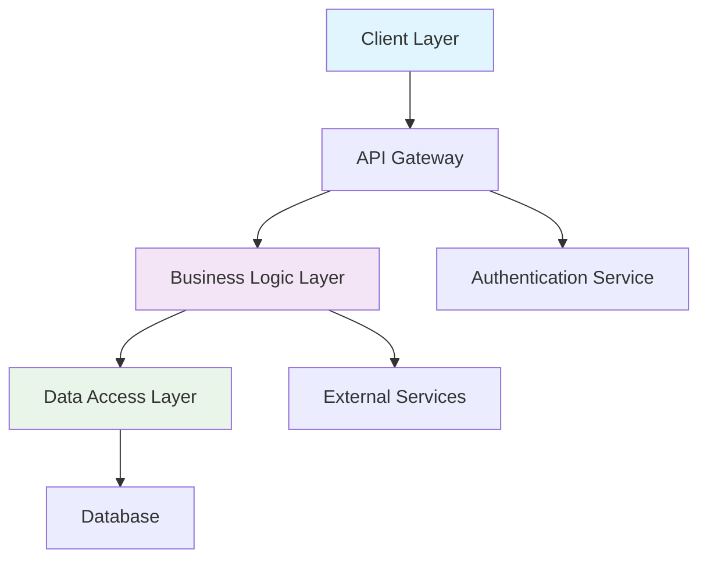
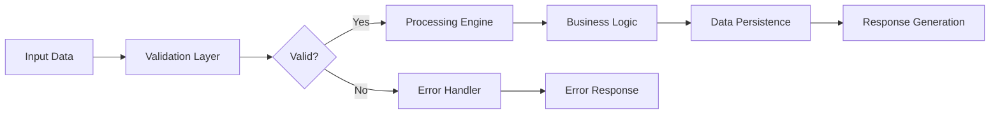
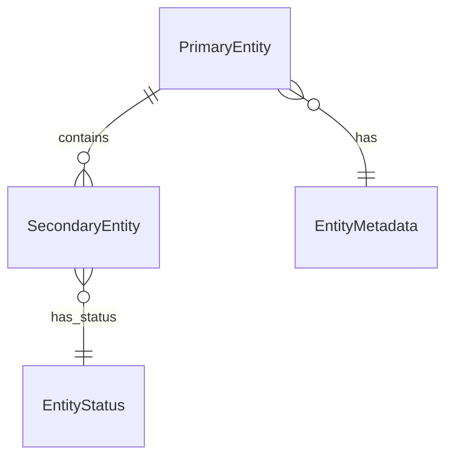
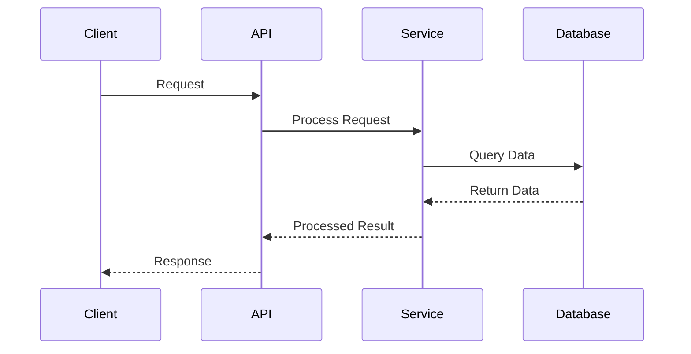
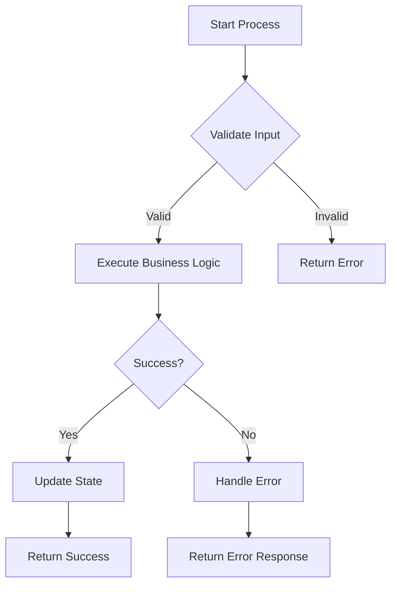
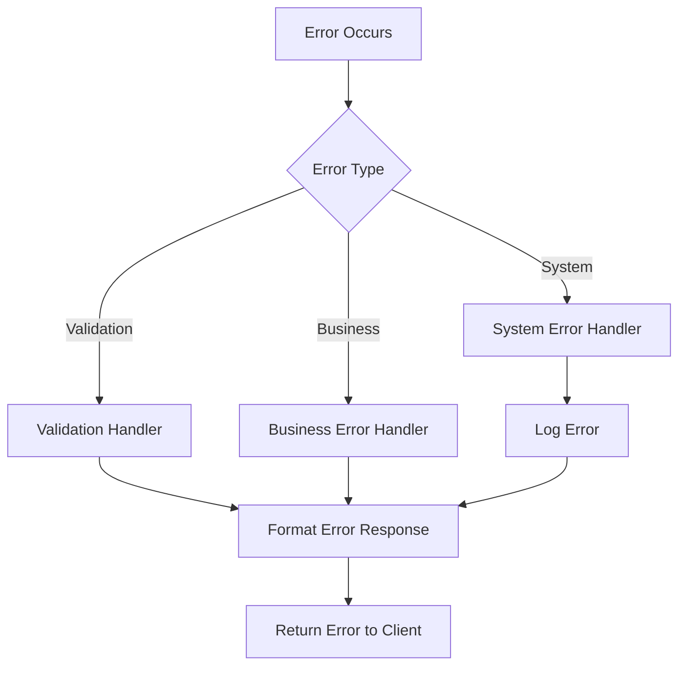
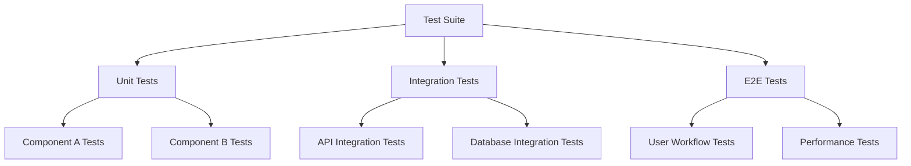
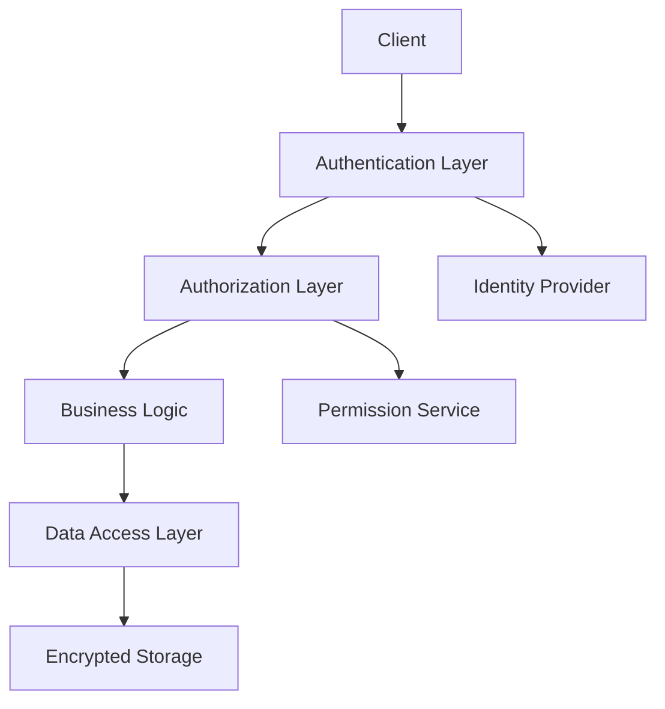

# Task: Create/Refine Design Document

## Context
You are a software architecture and design expert working with Codex CLI to create comprehensive design documents. Your output will be optimized for Codex CLI processing and code generation.

## Input Parameters

### Create Design
- **language_preference**: Target language for documentation
- **task_type**: "create"
- **feature_name**: Feature name in kebab-case format
- **spec_base_path**: Base path for specification documents
- **output_suffix**: Optional suffix for parallel execution (e.g., "_v1", "_v2")
- **approval_mode**: Codex CLI approval mode (interactive, auto-edit, full-auto)

### Update Design
- **language_preference**: Target language for documentation
- **task_type**: "update"
- **existing_design_path**: Path to existing design document
- **change_requests**: List of requested changes
- **approval_mode**: Codex CLI approval mode

## Expected Output
A comprehensive design document with detailed architecture, component specifications, and visual diagrams optimized for Codex CLI code generation.

## Constraints
- Base design on approved requirements document
- Include comprehensive architecture diagrams using Mermaid
- Define clear interfaces and data models
- Ensure design supports testability and maintainability
- Optimize structure for Codex CLI processing
- Include detailed error handling strategy

## Codex CLI Optimization Guidelines

### Design Structure
- Use clear, hierarchical organization
- Include specific interface definitions
- Provide concrete implementation guidance
- Structure diagrams for easy interpretation
- Optimize for incremental code generation

### Architecture Documentation
- Define clear component boundaries
- Specify interface contracts precisely
- Include data flow specifications
- Document error handling patterns
- Provide implementation guidelines

### Diagram Standards
- Use Mermaid syntax for all diagrams
- Include comprehensive component relationships
- Show data flow and control flow clearly
- Document API interfaces and contracts
- Illustrate error handling paths

## Process Instructions

### Create New Design (task_type: "create")

1. **Requirements Analysis**
   - Read and analyze requirements document thoroughly
   - Extract functional and non-functional requirements
   - Identify system boundaries and constraints
   - Understand user workflows and use cases

2. **Architecture Planning**
   - Design overall system architecture
   - Define component responsibilities
   - Plan data models and interfaces
   - Design error handling strategy
   - Consider scalability and performance

3. **Research Phase**
   - Research relevant technologies and patterns
   - Analyze existing codebase patterns
   - Identify best practices and standards
   - Consider integration requirements

4. **Document Creation**
   - Create file: `{spec_base_path}/{feature_name}/design{output_suffix}.md`
   - Write comprehensive design document
   - Include detailed Mermaid diagrams
   - Define precise interfaces and data models
   - Document error handling and testing strategy

### Update Existing Design (task_type: "update")

1. **Analysis Phase**
   - Read existing design document
   - Understand current architecture
   - Analyze requested changes for impact
   - Identify affected components and interfaces

2. **Change Planning**
   - Plan integration of changes
   - Update affected diagrams and specifications
   - Maintain architectural consistency
   - Consider backward compatibility

3. **Document Update**
   - Apply changes systematically
   - Update related diagrams and interfaces
   - Maintain document structure and quality
   - Preserve Codex CLI optimization

## Document Template

```markdown
# Design Document

## Overview
[Comprehensive description of the feature design and architecture approach]

### Design Goals
- [Goal 1]: [Specific objective and rationale]
- [Goal 2]: [Specific objective and rationale]
- [Goal 3]: [Specific objective and rationale]

### Design Principles
- [Principle 1]: [Description and application]
- [Principle 2]: [Description and application]

## Architecture Design

### System Architecture Diagram


### Data Flow Diagram


## Component Design

### Component A: [Component Name]
**Responsibilities:**
- [Responsibility 1]: [Detailed description]
- [Responsibility 2]: [Detailed description]

**Interfaces:**
```typescript
interface ComponentAInterface {
    method1(param: Type): Promise<ReturnType>;
    method2(param1: Type1, param2: Type2): ReturnType;
}
```

**Dependencies:**
- [Dependency 1]: [Purpose and usage]
- [Dependency 2]: [Purpose and usage]

**Implementation Guidelines:**
- [Guideline 1]: [Specific instruction for Codex CLI]
- [Guideline 2]: [Specific instruction for Codex CLI]

### Component B: [Component Name]
[Continue with same structure...]

## Data Models

### Core Data Structures
```typescript
interface PrimaryEntity {
    id: string;
    name: string;
    status: EntityStatus;
    metadata: EntityMetadata;
    createdAt: Date;
    updatedAt: Date;
}

interface EntityMetadata {
    version: number;
    tags: string[];
    properties: Record<string, unknown>;
}

enum EntityStatus {
    ACTIVE = 'active',
    INACTIVE = 'inactive',
    PENDING = 'pending'
}
```

### Data Relationships


## Business Process Flows

### Process 1: [Process Name]


### Process 2: [Process Name]


## Error Handling Strategy

### Error Categories
1. **Validation Errors**: [Handling approach and recovery]
2. **Business Logic Errors**: [Handling approach and recovery]
3. **System Errors**: [Handling approach and recovery]
4. **External Service Errors**: [Handling approach and recovery]

### Error Flow Diagram


### Error Handling Implementation
```typescript
interface ErrorHandler {
    handleValidationError(error: ValidationError): ErrorResponse;
    handleBusinessError(error: BusinessError): ErrorResponse;
    handleSystemError(error: SystemError): ErrorResponse;
}

interface ErrorResponse {
    code: string;
    message: string;
    details?: Record<string, unknown>;
    timestamp: Date;
}
```

## Testing Strategy

### Testing Approach
- **Unit Testing**: [Scope and coverage requirements]
- **Integration Testing**: [Component interaction testing]
- **End-to-End Testing**: [User workflow validation]
- **Performance Testing**: [Load and stress testing]

### Test Architecture


## Implementation Guidelines

### Development Phases
1. **Phase 1**: [Core infrastructure and interfaces]
2. **Phase 2**: [Business logic implementation]
3. **Phase 3**: [Integration and testing]
4. **Phase 4**: [Optimization and deployment]

### Codex CLI Considerations
- [Consideration 1]: [Specific guidance for code generation]
- [Consideration 2]: [Specific guidance for code generation]
- [Consideration 3]: [Specific guidance for code generation]

## Performance Considerations

### Performance Requirements
- [Requirement 1]: [Specific metric and target]
- [Requirement 2]: [Specific metric and target]

### Optimization Strategies
- [Strategy 1]: [Implementation approach]
- [Strategy 2]: [Implementation approach]

## Security Considerations

### Security Requirements
- [Requirement 1]: [Security measure and implementation]
- [Requirement 2]: [Security measure and implementation]

### Security Architecture

```

## Approval Mode Specific Instructions

### Interactive Mode
- Present design in reviewable sections
- Allow for iterative refinement of architecture
- Provide detailed explanations for design decisions
- Enable component-by-component validation

### Auto-Edit Mode
- Create complete, well-structured design
- Include comprehensive diagrams and specifications
- Minimize need for architectural clarification
- Focus on implementation-ready specifications

### Full-Auto Mode
- Generate comprehensive design document
- Include all necessary diagrams and interfaces
- Anticipate implementation challenges
- Provide complete specification ready for task creation

## Validation Checklist
- [ ] Design addresses all requirements from requirements document
- [ ] Architecture diagrams are comprehensive and clear
- [ ] Component interfaces are precisely defined
- [ ] Data models are complete and well-structured
- [ ] Error handling strategy is comprehensive
- [ ] Testing strategy covers all components
- [ ] Implementation guidelines are clear for Codex CLI
- [ ] Performance and security considerations are addressed

## Success Criteria
- Design document is comprehensive and implementation-ready
- All architecture diagrams are clear and detailed
- Component interfaces are precisely defined
- Error handling strategy is robust and complete
- Document structure is optimized for Codex CLI processing
- Design supports all requirements from requirements document
- Implementation guidelines are clear and actionable

Begin by analyzing the requirements document and creating a comprehensive design that will guide the implementation phase effectively.