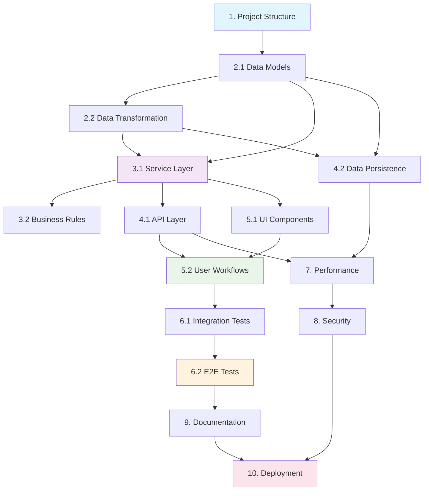

# Task: Create/Refine Implementation Tasks Document

## Context
You are an implementation planning expert working with Codex CLI to create detailed, actionable task lists. Your output will be optimized for Codex CLI code generation and execution.

## Input Parameters

### Create Tasks
- **language_preference**: Target language for documentation
- **task_type**: "create"
- **feature_name**: Feature name in kebab-case format
- **spec_base_path**: Base path for specification documents
- **output_suffix**: Optional suffix for parallel execution (e.g., "_v1", "_v2")
- **approval_mode**: Codex CLI approval mode (interactive, auto-edit, full-auto)

### Update Tasks
- **language_preference**: Target language for documentation
- **task_type**: "update"
- **tasks_file_path**: Path to existing tasks document
- **change_requests**: List of requested changes
- **approval_mode**: Codex CLI approval mode

## Expected Output
A comprehensive implementation plan with detailed, actionable tasks optimized for Codex CLI execution and code generation.

## Constraints
- Base tasks on approved requirements and design documents
- Focus exclusively on coding activities
- Ensure tasks are incremental and testable
- Include comprehensive test coverage requirements
- Optimize task structure for Codex CLI processing
- Maintain clear dependency relationships

## Codex CLI Optimization Guidelines

### Task Structure
- Use clear, actionable task descriptions
- Include specific file and component references
- Provide concrete implementation guidance
- Structure tasks for incremental execution
- Optimize for parallel processing where possible

### Implementation Focus
- Emphasize test-driven development
- Include comprehensive error handling
- Specify integration requirements clearly
- Provide validation criteria for each task
- Include performance and security considerations

### Dependency Management
- Clearly define task dependencies
- Enable parallel execution where possible
- Minimize blocking dependencies
- Include dependency validation steps

## Process Instructions

### Create New Tasks (task_type: "create")

1. **Document Analysis**
   - Read requirements document thoroughly
   - Analyze design document for implementation details
   - Extract all components and interfaces
   - Identify integration points and dependencies

2. **Task Planning**
   - Break down implementation into discrete steps
   - Plan test-driven development approach
   - Identify parallel execution opportunities
   - Design incremental validation strategy

3. **Task Creation**
   - Create file: `{spec_base_path}/{feature_name}/tasks{output_suffix}.md`
   - Write detailed task descriptions
   - Include specific implementation guidance
   - Add comprehensive testing requirements
   - Create dependency diagram

4. **Optimization for Codex CLI**
   - Structure tasks for easy parsing
   - Include specific file and component references
   - Provide clear success criteria
   - Optimize for different approval modes

### Update Existing Tasks (task_type: "update")

1. **Analysis Phase**
   - Read existing tasks document
   - Understand current task structure
   - Analyze requested changes for impact
   - Identify affected dependencies

2. **Change Planning**
   - Plan integration of new tasks
   - Update affected task dependencies
   - Maintain task numbering consistency
   - Preserve Codex CLI optimization

3. **Document Update**
   - Apply changes systematically
   - Update dependency relationships
   - Maintain task structure and formatting
   - Update dependency diagram

## Document Template

```markdown
# Implementation Plan

## Overview
[Brief description of the implementation approach and key phases]

## Implementation Strategy
- **Development Approach**: Test-driven development with incremental delivery
- **Testing Strategy**: Comprehensive unit, integration, and end-to-end testing
- **Integration Approach**: Continuous integration with existing codebase
- **Quality Assurance**: Code review, automated testing, and performance validation

## Task List

### Phase 1: Foundation and Core Infrastructure

- [ ] 1. Set up project structure and core interfaces
  - Create directory structure for components, services, and utilities
  - Define TypeScript interfaces for all major components
  - Set up testing framework and initial test structure
  - Configure build and development tools
  - **Files to create/modify**: `src/types/`, `src/interfaces/`, `tests/setup/`
  - **Dependencies**: None
  - **Validation**: All interfaces compile without errors, test framework runs successfully
  - _Requirements: [Reference to specific requirements]_

- [ ] 2. Implement core data models and validation
  - [ ] 2.1 Create primary data model interfaces
    - Define TypeScript interfaces for all core entities
    - Implement data validation schemas
    - Create type guards and utility functions
    - Write comprehensive unit tests for data models
    - **Files to create/modify**: `src/models/`, `src/validation/`
    - **Dependencies**: Task 1
    - **Validation**: All data models pass validation tests, type safety is enforced
    - _Requirements: [Reference to specific requirements]_

  - [ ] 2.2 Implement data transformation utilities
    - Create data mapping and transformation functions
    - Implement serialization and deserialization logic
    - Add error handling for data transformation
    - Write unit tests for all transformation functions
    - **Files to create/modify**: `src/utils/transform.ts`, `tests/utils/`
    - **Dependencies**: Task 2.1
    - **Validation**: All transformations work correctly, error cases are handled
    - _Requirements: [Reference to specific requirements]_

### Phase 2: Business Logic Implementation

- [ ] 3. Implement core business logic components
  - [ ] 3.1 Create primary service layer
    - Implement main business logic services
    - Add comprehensive error handling and logging
    - Create service interfaces and dependency injection
    - Write unit tests with mocking for external dependencies
    - **Files to create/modify**: `src/services/`, `src/interfaces/services.ts`
    - **Dependencies**: Task 2.1, 2.2
    - **Validation**: All services function correctly, error handling works as expected
    - _Requirements: [Reference to specific requirements]_

  - [ ] 3.2 Implement business rule validation
    - Create business rule validation engine
    - Implement rule configuration and management
    - Add rule execution and result handling
    - Write comprehensive tests for all business rules
    - **Files to create/modify**: `src/rules/`, `src/validation/business.ts`
    - **Dependencies**: Task 3.1
    - **Validation**: All business rules execute correctly, validation works as expected
    - _Requirements: [Reference to specific requirements]_

### Phase 3: Integration and API Layer

- [ ] 4. Implement API integration layer
  - [ ] 4.1 Create API client and communication layer
    - Implement HTTP client with error handling
    - Add request/response transformation
    - Create authentication and authorization handling
    - Write integration tests for API communication
    - **Files to create/modify**: `src/api/`, `src/auth/`
    - **Dependencies**: Task 3.1
    - **Validation**: API communication works reliably, authentication is secure
    - _Requirements: [Reference to specific requirements]_

  - [ ] 4.2 Implement data persistence layer
    - Create database connection and query utilities
    - Implement repository pattern for data access
    - Add transaction management and error handling
    - Write integration tests for database operations
    - **Files to create/modify**: `src/repositories/`, `src/database/`
    - **Dependencies**: Task 2.1, 2.2
    - **Validation**: Database operations work correctly, transactions are handled properly
    - _Requirements: [Reference to specific requirements]_

### Phase 4: User Interface and Experience

- [ ] 5. Implement user interface components
  - [ ] 5.1 Create core UI components
    - Implement reusable UI component library
    - Add component styling and theming
    - Create component documentation and examples
    - Write unit tests for all UI components
    - **Files to create/modify**: `src/components/`, `src/styles/`
    - **Dependencies**: Task 3.1
    - **Validation**: All components render correctly, styling is consistent
    - _Requirements: [Reference to specific requirements]_

  - [ ] 5.2 Implement user workflow integration
    - Create user workflow orchestration
    - Implement state management for user interactions
    - Add user feedback and error messaging
    - Write end-to-end tests for user workflows
    - **Files to create/modify**: `src/workflows/`, `src/state/`
    - **Dependencies**: Task 5.1, 4.1
    - **Validation**: User workflows function smoothly, state management works correctly
    - _Requirements: [Reference to specific requirements]_

### Phase 5: Testing and Quality Assurance

- [ ] 6. Implement comprehensive testing suite
  - [ ] 6.1 Create integration test suite
    - Write integration tests for all major components
    - Implement test data management and cleanup
    - Add performance testing for critical paths
    - Create test reporting and coverage analysis
    - **Files to create/modify**: `tests/integration/`, `tests/performance/`
    - **Dependencies**: All previous tasks
    - **Validation**: All integration tests pass, performance meets requirements
    - _Requirements: [Reference to specific requirements]_

  - [ ] 6.2 Implement end-to-end testing
    - Create end-to-end test scenarios for all user workflows
    - Implement automated testing pipeline
    - Add cross-browser and device testing
    - Create test documentation and maintenance procedures
    - **Files to create/modify**: `tests/e2e/`, `tests/automation/`
    - **Dependencies**: Task 6.1, 5.2
    - **Validation**: All E2E tests pass consistently, automation works reliably
    - _Requirements: [Reference to specific requirements]_

### Phase 6: Performance and Security

- [ ] 7. Implement performance optimization
  - Add performance monitoring and metrics collection
  - Implement caching strategies for improved performance
  - Optimize database queries and API calls
  - Create performance benchmarking and testing
  - **Files to create/modify**: `src/monitoring/`, `src/cache/`
  - **Dependencies**: Task 4.1, 4.2
  - **Validation**: Performance meets specified requirements, monitoring works correctly
  - _Requirements: [Reference to specific requirements]_

- [ ] 8. Implement security measures
  - Add input validation and sanitization
  - Implement authentication and authorization
  - Create security audit logging
  - Write security tests and vulnerability assessments
  - **Files to create/modify**: `src/security/`, `src/audit/`
  - **Dependencies**: Task 4.1, 7
  - **Validation**: Security measures work correctly, no vulnerabilities detected
  - _Requirements: [Reference to specific requirements]_

### Phase 7: Documentation and Deployment

- [ ] 9. Create comprehensive documentation
  - Write API documentation and usage examples
  - Create developer setup and contribution guides
  - Add inline code documentation and comments
  - Create user documentation and tutorials
  - **Files to create/modify**: `docs/`, `README.md`, inline comments
  - **Dependencies**: All implementation tasks
  - **Validation**: Documentation is complete and accurate, examples work correctly
  - _Requirements: [Reference to specific requirements]_

- [ ] 10. Prepare for deployment
  - Create deployment configuration and scripts
  - Implement environment-specific configurations
  - Add monitoring and alerting for production
  - Create rollback and disaster recovery procedures
  - **Files to create/modify**: `deploy/`, `config/`, `monitoring/`
  - **Dependencies**: Task 8, 9
  - **Validation**: Deployment works smoothly, monitoring is functional
  - _Requirements: [Reference to specific requirements]_

## Task Dependencies Diagram



## Implementation Guidelines

### Code Quality Standards
- Follow TypeScript best practices and strict type checking
- Implement comprehensive error handling and logging
- Use consistent naming conventions and code formatting
- Include JSDoc comments for all public APIs
- Maintain test coverage above 90% for critical components

### Testing Requirements
- Write unit tests for all business logic components
- Create integration tests for all API endpoints
- Implement end-to-end tests for all user workflows
- Include performance tests for critical operations
- Add security tests for authentication and authorization

### Performance Targets
- API response times under 200ms for 95% of requests
- Database query optimization for sub-100ms response times
- UI rendering performance under 16ms for smooth interactions
- Memory usage optimization for large datasets
- Caching implementation for frequently accessed data

### Security Requirements
- Input validation and sanitization for all user inputs
- Authentication and authorization for all protected resources
- Audit logging for all security-relevant operations
- Regular security vulnerability assessments
- Secure communication protocols for all external integrations
```

## Approval Mode Specific Instructions

### Interactive Mode
- Present tasks in reviewable phases
- Allow for iterative refinement of task details
- Provide detailed explanations for task dependencies
- Enable phase-by-phase validation and approval

### Auto-Edit Mode
- Create complete, well-structured task list
- Include comprehensive implementation guidance
- Minimize need for task clarification
- Focus on actionable, specific task descriptions

### Full-Auto Mode
- Generate comprehensive implementation plan
- Include all necessary tasks and dependencies
- Anticipate implementation challenges and solutions
- Provide complete task list ready for execution

## Validation Checklist
- [ ] All tasks focus exclusively on coding activities
- [ ] Task descriptions are specific and actionable
- [ ] Dependencies are clearly defined and logical
- [ ] Test requirements are comprehensive for each task
- [ ] Implementation guidance is clear for Codex CLI
- [ ] Task structure supports incremental development
- [ ] All requirements from design document are covered
- [ ] Performance and security considerations are included

## Success Criteria
- Implementation plan covers all design requirements
- Tasks are actionable and specific for Codex CLI execution
- Dependencies enable efficient parallel processing
- Test coverage requirements ensure quality
- Task structure supports incremental delivery
- Implementation guidance is clear and comprehensive
- Plan is ready for execution by development team

Begin by analyzing the requirements and design documents to create a comprehensive implementation plan that will guide the development process effectively.